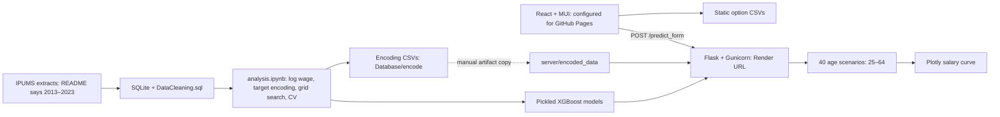
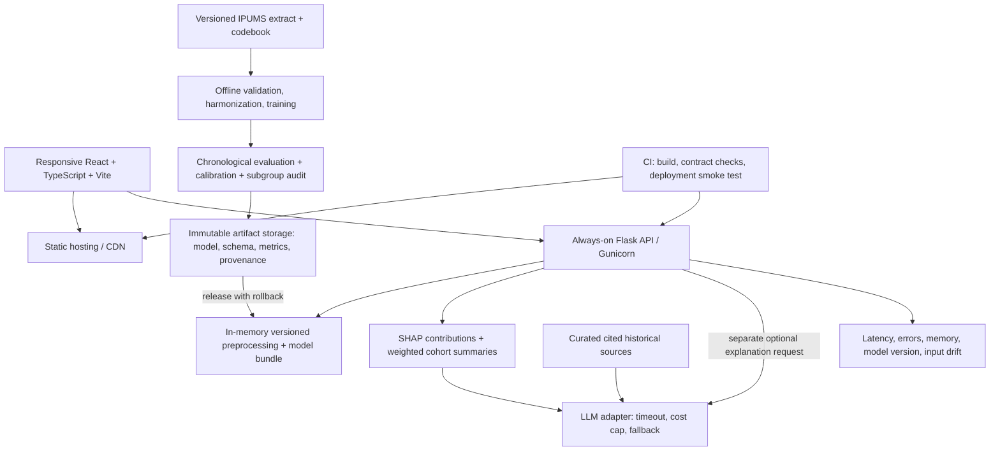
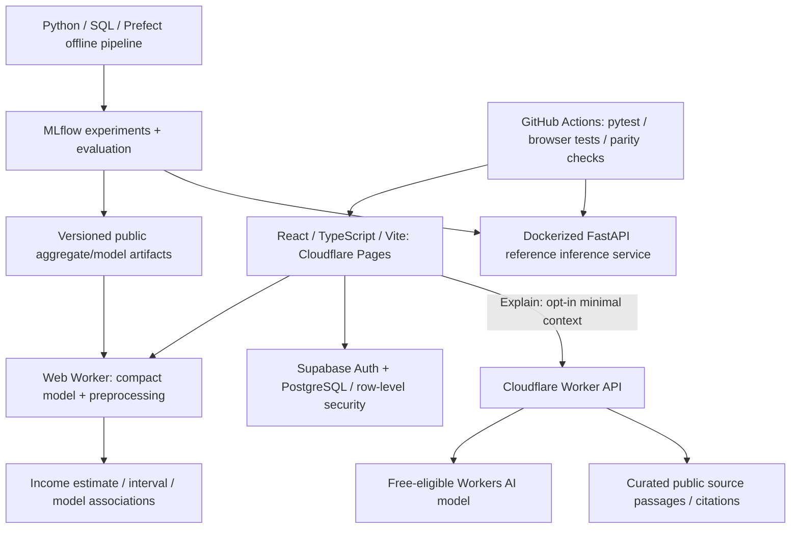

# WageInsight architecture audit and proposed design

**Decision update:** Section 4 supersedes the original paid-service proposal in Section 3 following the user's budget, audience, privacy, and career requirements. Sections 1–2 remain the historical audit.

**Implementation update:** The first local rebuild is working: React/TypeScript browser inference, trained compact quantile models, comparison/export and occupation peers, FastAPI reference API, Supabase schema/client integration, optional AI adapter, and automated checks. See README.md and MODEL_CARD.md for actual metrics, and DEPLOYMENT.md for remaining external setup and release gates. Earlier statements that no rewrite has started are historical. MLflow/Prefect, BI/dbt, state price parities, public hosting, and live auth/AI verification remain outstanding.

Reviewed October 7, 2026. Scope: tracked application, SQL, training notebook, dependency manifests, deployment configuration, and embedded model feature metadata. This is a code audit and design; no application behavior was changed. Live hosting configuration, latency, and model accuracy were not measured. Runtime model loading was unavailable because the local Python environment lacks XGBoost; binary metadata confirms the expected feature names.

## 1. Current architecture

- `DataCleaning.sql`: joins category labels, reduces demographic codes to binary values, keeps wages $15,000–$500,000. The resulting SQL table omits survey year, survey weights, hours, and weeks worked. The referenced `CSC498.db` is absent from this checkout.
- `analysis.ipynb`: reads SQLite, drops missing rows, logs wages, creates smoothed target encodings, tunes OLS/Lasso/XGBoost, and performs random K-fold evaluation. Exports unsmoothed category means separately.
- `server/app.py`: generates 40 rows from a profile, encodes them, loads a model, exponentiates predictions, returns `{series:[{age,salary}]}`. No individual age is collected. `/health` only reports that the process responds.
- `server/encoder.py`: binary mappings plus per-request CSV reads; unknown categories become zero and unknown binary values become -1.
- `client/src/WageInsightForm.jsx`: Basic uses five fields plus generated age; Advanced uses thirteen plus generated age. Loads seven CSV requests sequentially, including degree twice. Sends requests to a hardcoded Render URL; displays a fixed-width plot.
- No active database, account system, LLM, explanation endpoint, model registry, or retraining service. `FileUpload.js` is unused and targets an absent `/predict` endpoint.
- README claims written disparity summaries and dollar-scale evaluation that are not demonstrated by the implemented UI or saved notebook outputs.

## 2. Issues and adjustments

| Priority | Evidence / issue | Adjustment |
|---|---|---|
| P0 | Notebook computes target encodings using all outcomes before CV; scaler also fits globally. Hyperparameter selection and subsequent CV reuse the same dataset. | Split first; fit preprocessing within each training fold, cross-fit target encoding, and reserve an untouched chronological test set. [Cross-fitting documentation](https://sklearn.org/stable/modules/preprocessing.html). |
| P0 | SQL maps `VETSTAT=2` to zero, while serving maps Veteran to one. IPUMS general codes identify 2 as veteran and 1 as non-veteran. | Fix recoding and retrain affected models; test all mappings against the extract codebook, including missing/N/A. [IPUMS VETSTAT](https://usa.ipums.org/usa-action/variables/VETSTAT). |
| P0 | Training uses smoothed category means; exported/served mappings are unsmoothed. Notebook trains 14 features but writes `basic_xgb_model.pkl`; actual saved basic artifact has six, advanced fourteen. | Export each complete fitted preprocessing/model bundle through a reproducible script with feature schema, dataset hash, metrics, and version. Current notebook does not explain the checked-in artifacts. |
| P0 | `render.yaml` installs nonexistent `server/requirements.txt`; Windows `set NODE_OPTIONS=...` syntax is used in Linux build scripts. Static publish configuration is mixed into a Python service whose `/` serves only a greeting. | Define distinct static frontend and API services, correct dependency paths, use portable scripts, pin dependencies, and verify clean deployment. [Render Blueprint reference](https://render.com/docs/blueprint-spec). |
| P1 | Every prediction rereads encoders and reloads an approximately 37 MB basic or 11 MB advanced artifact. | Load bundles once per worker, validate at startup, batch scenarios, cap model threads, measure memory and p95 latency. |
| P1 | User reports sleeping backend; actual hosting plan is unverified. | Use an always-on paid API instance. Render documents idle spin-down for free services. [Render free services](https://render.com/docs/free). |
| P1 | No server schema validation; bad modes silently select basic behavior; errors return internals as HTTP 500. Health does not check artifacts. | Validate modes, fields, categories, ranges, and request size; return structured 4xx errors; separate liveness/readiness; add rate limits and safe logs. |
| P1 | Frontend does not check HTTP status, set a timeout, or surface server errors; CSV loader treats any HTTP body as options. | Typed API contract, status checks, cancellation/timeouts, inline recovery states; serve one versioned options JSON with stable IDs. |
| P1 | Annual wage income is presented as salary; pooled years have no retained year/weights or visible inflation adjustment. Wage truncation excludes important populations. | Define annual wage income and supported population explicitly. Re-extract year, PERWT, hours/weeks, and employment status; account for inflation, top codes, N/A, and changing classifications. [INCWAGE](https://usa.ipums.org/usa-action/variables/INCWAGE), [inflation adjustment](https://usa.ipums.org/usa/cpi99.shtml). |
| P1 | Notebook evaluation target is log wage; no saved outputs verify README's $54k RMSE or R²≈0.50. `exp(predicted log wage)` is not generally expected dollar income. | Evaluate dollar MAE/RMSE/R² and log error separately; choose a median/quantile target or calibrate retransformation if estimating a mean. |
| P1 | Single curve has no uncertainty; fixed occupation across ages can imply a career forecast. | Show selected-age estimate plus calibrated prediction range. Label age scenarios as cross-sectional model estimates, with support warnings. |
| P2 | Generic styling, long required form, fixed 700px plot, no input age, and mode changes erase profile. | Responsive themed cards, grouped inputs, optional degree fields, clear annual-income estimate, preserved inputs, accessible charts, and scenario comparisons. |
| P2 | Sensitive attributes influence Advanced predictions; dataset SEX is labeled Gender. | Explain measured variables accurately; make demographic exploration optional, compare subgroup errors, and distinguish model associations from causal effects. |
| P2 | Stale CRA placeholder test; no substantive API/ML checks or CI. Runtime requirements include notebook-only dependencies. | Separate training/runtime environments; add CI for clean builds, API contracts, artifact schema and mapping parity, and one full prediction flow. |

## 3. Proposed deployable architecture

Keep a small monolith for online inference; Flask is sufficient. A framework rewrite is optional.

### Online contract and experience

- `GET /api/v1/options`: stable category IDs/labels and schema version.
- `POST /api/v1/predict`: validated profile including age; returns estimate, calibrated range, age scenarios, baseline, feature contributions with defined units, cohort support, currency/base year, and model version.
- `POST /api/v1/explain`: server-controlled validated prediction context; returns grounded explanation and source links. Prediction remains usable during LLM failure.
- `GET /health/live` and `/health/ready`: readiness checks loaded artifacts and expected schema.
- Result screen: annual-income card, range band, responsive age plot, positive/negative model contributions, scenario comparison, and concise contextual explanation. Log-space SHAP contributions must be labeled as such or converted into a mathematically valid explanation; do not present them as additive dollar effects.
- LLM explains computed numbers and cited source passages. It cannot invent historical explanations or claim demographic traits cause wage differences. Use deterministic text when unavailable; keep credentials server-side and omit unnecessary profile data from logs/providers.

### Offline ML lifecycle

1. Record extract provenance and sampling universe; retain year and weights, harmonize occupations/industries across years, correct categorical coding, and define base-year dollars.
2. Chronological train/validation/calibration/test partitions; isolate households or overlapping records where appropriate. Keep final test untouched by tuning. Use fold-local preprocessing and cross-fitted target encoding.
3. Benchmark weighted cohort median and linear models against corrected XGBoost; evaluate a native categorical challenger only if useful. Improve features before expanding the tuning budget; no promised R² gain.
4. Train a career/location estimator and optional demographic research variant with an explicit comparison. Add quantile estimates and held-out interval calibration, then inspect coverage by subgroup and year.
5. Publish immutable bundles and machine-readable model cards. Refresh on new data; promote only after evaluation, retain a rollback version, and monitor drift and delayed accuracy when labels become available.

### Deployment and completion gates

- Frontend static service plus one paid always-on API service; locked runtime dependencies and portable builds. Start with memory-resident artifacts and bounded in-process caching. Add Redis or a queue only after measured load requires them. Add Postgres/authentication when saved accounts/scenarios are actually needed.
- CI must prove both model modes work from a clean checkout, unknown inputs are handled correctly, training/serving transformations agree, and readiness rejects incomplete bundles.
- Proposed launch targets: warm prediction p95 below 500 ms at an agreed test load; no platform idle sleep; mobile and keyboard usability; recoverable API/LLM failures; dollar metrics beat the declared baseline on the untouched latest-year test; nominal prediction coverage checked overall and by adequately sized groups. These are targets, not current measurements.
- Implementation order: **repair coding/evaluation/artifact provenance → repair deployment and inference loading → redesign results and uncertainty → add grounded LLM explanations → automate refresh/monitoring**.

## 4. Revised $0 portfolio architecture

**Data readiness update:** The new CSV and PDF codebook have been inspected; see `DATA_AUDIT.md`. 5,333,667 records meet age/hours/weeks/wage-worker/geography criteria before income-quality processing. Data arrival is no longer a blocker. QINCWAGE is absent; filter the included UHRSWORK locally. References below to awaiting the extract are superseded by this update.

### Product commitments

US residents aged 25–64 exploring wage disparities and career/major choices. One progressive form; age and career/location inputs first, optional demographics second. The population is wage/salary workers reporting at least 35 usual hours/week and at least 50 weeks/year; exclude self-employed workers. Full-time annual pay is proxied by prior-12-month wage income; ACS cannot establish contractual base salary or future career outcomes. Result priority: estimate/range, explanations, career/education scenarios, weighted peer statistics, then age scenarios. Support guest sessions, optional accounts, explicit save/delete, comparison of several profiles, and export. Footer credit: [Built by Tran Le](https://github.com/tranle1411/wageinsight). Calendar-year and age scenarios are supported within data coverage; actual years of experience are not inferred. Product choices are settled; final training awaits the new extract and codebook. No application rewrite has started.

### Runtime design

- **Core availability/privacy:** run predictions locally in a browser Web Worker; guest inputs and scenarios live only in session memory. Model/aggregate caching is permitted; guest profile persistence is not. A compact browser bundle must pass accuracy, download-size, memory, and Python/browser parity gates before adopting this deployment path. Public trained artifacts require an IPUMS terms/disclosure review; never publish respondent rows.
- **Inference feasibility spike:** first export a small tree ensemble with its complete preprocessing schema. Try ONNX Runtime Web only if conversion supports the actual fitted pipeline. A compact JSON tree evaluator is an alternative. Do not assume existing pickles can execute in a browser or ship their large binary payloads unchanged. Target compressed initial model payload under 10 MB; Cloudflare Pages has a [25 MiB per-file limit](https://developers.cloudflare.com/pages/platform/limits/).
- **Explanations:** local deterministic text and plausible scenario deltas are always available. Label scenario deltas as model associations. Use offline SHAP for model analysis; per-profile SHAP requires an implementation and Python parity check before advertising it. Optional retrieval uses a small indexed, curated corpus and source passages, with citation/number-grounding evaluations; embeddings/vector storage only if they improve retrieval measurably.
- **LLM:** serverless Cloudflare Worker validates inputs, caps context/output, and calls a free-eligible Workers AI model. No secrets in the browser. Use rate limits, optional Turnstile, an application budget guard, and deterministic fallback. [Workers AI](https://developers.cloudflare.com/workers-ai/platform/pricing/) currently includes 10,000 neurons/day on the Free plan; excess calls fail. Some models require paid billing, so they are excluded. Optional explanation requests disclose third-party processing.
- **Accounts:** Supabase Auth with PostgreSQL predictions/scenarios tables and owner-only row-level security; verify that one user cannot access another's data. Save only on an explicit Save action; authenticated predictions also remain unsaved until that action. Support deletion of individual saved predictions. Guest use creates no auth record. Google/GitHub OAuth plus email/password with email ownership verification and password reset. A confirmation code may be used through a supported provider flow; email ownership verification is distinct from requiring a second factor on every login. Public email verification requires custom SMTP: Supabase's [default email service](https://supabase.com/docs/guides/auth/auth-smtp) is restricted to project-team addresses and currently two messages/hour. Select a free SMTP provider with an eligible verified sender before exposing public email signup; do not weaken verification to bypass delivery restrictions. [Supabase Free](https://supabase.com/pricing) includes 500 MB database capacity but can pause after inactivity, so prediction continues without accounts. Saved histories need export/backups; no availability guarantee is promised.
- **Python API:** FastAPI/Pydantic, REST/OpenAPI, Docker, structured logs, readiness, JWT verification where relevant, and latency tests. It provides reproducible local inference, browser parity checks, and an upgrade path to hosted server inference. Do not present it as the always-on production serving path when it is only run locally or on a sleeping demo service.

### Data, ML, and portfolio evidence

- Existing `Database/raw.csv` is approximately 130 MB and has 26 columns. It lacks YEAR, SAMPLE, SERIAL/PERNUM identifiers, PERWT, hours, weeks, and adjustment fields. This is suitable for provisional pipeline development, not full-time/inflation validation. See `DATA_REQUEST.md`.
- Use pandas chunked ingestion and SQL/Parquet staging rather than recreating the old database as a hard dependency. Prefect locally orchestrates validated, idempotent ingestion, transformation, training, calibration, and publication. Track extract/checksum/schema lineage. PostgreSQL stores application data; DuckDB/Parquet can handle offline analytics. Raw data remains local and outside Git.
- MLflow runs locally with experiment parameters, metrics, dataset hashes, artifact versions, and model promotion records. No paid tracking server. Train in successive samples, cap threads/memory, and use early stopping and a bounded search. Compare weighted occupation/state/education medians and regularized regression against corrected XGBoost; optional CatBoost/PyTorch challenger only if resource/time budget permits.
- Use chronological validation/calibration/test partitions, fold-local encoding, survey weights, consistent dollar base year, and top-code/missing-value handling. Document population exclusions. A demographics-free model provides career scenarios; an optional demographic variant and weighted observed group statistics provide disparity exploration. Explain raw differences, adjusted associations, and uncertainty separately; none establishes causation.
- Acceptance proposal: at least 10% lower weighted dollar MAE than the declared cohort baseline on untouched latest-year data; report RMSE/R²/log error without targeting an arbitrary R². Target an 80% prediction interval with 77–83% overall held-out coverage and subgroup coverage review using adequate effective sample sizes. Also report interval width and compare it with a cohort interval baseline. If criteria fail, revise the model or narrow supported scope rather than claim success.
- Deployment gates: Python/browser prediction parity within an agreed numeric tolerance; repeatable mobile/desktop p95 timing measured separately for first load and subsequent inference; initial target subsequent inference below 500 ms on a named reference device. CI covers preprocessing mappings, leakage prevention, API contracts, auth ownership/deletion, guest non-persistence, explanation fallback, responsive form/results, and export.
- Analyst extension: an aggregate wage-gap dashboard and downloadable cohort tables; optional Power BI Desktop report with Power Query/DAX, reproducible definitions, and screenshots. Do not upload microdata or imply free public Power BI hosting.
- Data engineering extension: small dimensional wage/cohort marts and dbt data tests if the SQL workflow is substantive enough; keep Prefect as the sole orchestrator. Do not add Kafka, Spark, Kubernetes, or cloud warehouses for this workload. AWS is a documented optional deployment path, not a deployed resume claim at $0.
- Resume evidence: architecture diagram, data/model cards, evaluated metrics and tradeoffs, CI badges, reproducible Docker setup, test reports, MLflow experiment screenshots, dashboard artifacts, and a short demo. Only claim implemented technologies and measured outcomes.

### Confirmed implementation priorities and degradation behavior

- Career presentation order: **SWE → ML Engineer → Data Scientist → Data Analyst → Data Engineer**. Emphasize maintainable TypeScript/Python modules, API design, database schema/migrations, secure ownership checks, unit/integration/end-to-end tests, concurrency via Web Workers, CI/CD, deployment, performance, and failure recovery. Add MLflow, model evaluation, and statistical analysis next; BI/dbt remain extensions.
- Guest explanations: local deterministic text first; a collapsible Explain button optionally sends minimal, disclosed prediction-derived context to the free Cloudflare LLM route. No guest history or explanation content is persisted by the application; omit profile/request bodies from application logs. Do not promise that third-party processing is invisible or has zero provider retention.
- On confirmed daily quota exhaustion, show: "Further explanation is unavailable right now. Try again at [localized reset time]." Workers AI resets at **00:00 UTC** per its [pricing documentation](https://developers.cloudflare.com/workers-ai/platform/pricing/). Render the next reset in the visitor's timezone with date/timezone; in America/New_York this is 8 PM during daylight saving time and 7 PM during standard time. Do not attribute network errors, short-term throttling, or service outages to the daily quota; give a suitable retry message for those errors. Estimates and deterministic explanations remain usable.
- Pending external dependencies: new IPUMS extract/codebook, Cloudflare/Supabase accounts, OAuth credentials, and a suitable free email sender. Account setup and sender verification may require user login/MFA; credentials belong in service settings, not Git or chat. No further product clarification is required before independent implementation work.

### Inflation and geography

Normalize wages over time to the latest complete agreed base year using a documented national price index, accounting for IPUMS/ACS income adjustment conventions so adjustment is not applied twice. Local CPI measures local price changes and does not compare price levels across places; there is not a uniform CPI series for every state. [BLS explanation](https://www.bls.gov/cpi/questions-and-answers.htm).

Offer a separate purchasing-power comparison using [BEA Regional Price Parities](https://www.bea.gov/data/prices-inflation/regional-price-parities-state-and-metro-area) for state/year, using residence geography rather than automatically equating workplace with residence. Keep time inflation, geographic purchasing power, and model salary differences distinct. Converting older income to current dollars is not evidence of current labor-market wages.
