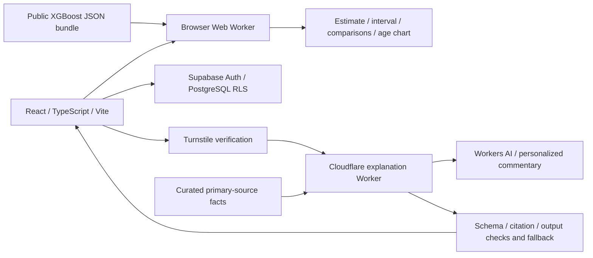
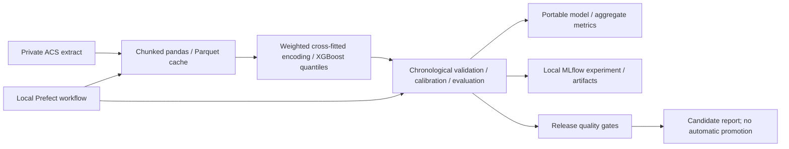

# WageInsight architecture
Updated 2026-10-08. This is the implementation architecture; optional extensions are separated below.

## Runtime

Frontend: Cloudflare Workers Static Assets, with checked-in client/wrangler.jsonc. Predicting is local; guest profiles and comparisons remain in memory. Recharts loads only when results need the age chart. Saved history is opt-in, owned by the authenticated user and protected by PostgreSQL row-level security. Login methods are live according to Tran Le's confirmation. Migration 002 adds bounded payloads and a concurrent-insert history limit; it still needs to be applied to the live database.

Explain is opt-in. Numeric comparisons remain deterministic. AI receives selected/reference labels, qualitative model direction, source facts and definitions; it receives no salary amounts or raw profile object. The Worker checks Turnstile success/action/hostname, bounded requests and burst limits. Generated passages must mention an actual selected category, cite approved sources applicable to that feature, and pass output checks. Canonical links and source facts come from the repository. Invalid prose uses a curated fallback; outages preserve the local interpretation. These controls constrain errors but cannot prove semantic grounding. Human evaluation remains necessary.

FastAPI is an optional Dockerized reference inference service with validation, cached model loading, readiness, bounded requests and latency logs. Public browser predictions do not depend on its availability.

## Offline ML lifecycle

The published model uses six ACS samples, ages 25-64, wage workers, at least 35 usual weekly hours and 50-52 weeks, US states/DC, and positive previous-12-month wage income. CPI99 converts time dollar basis; it does not adjust state cost of living or forecast calendar-year wages. Train uses 2018/2019/2021, validation 2022, calibration 2023, and evaluation 2024. Household folds protect target encoding. Portable/native and browser/Python parity checks support consistent inference.

Training defaults to .cache/candidate and preserves the public model. Cache keys include data hash, preprocessing code and pandas version. New artifacts record training code, labels, preprocessing and library versions. Public category dictionaries avoid dependence on private PDF text. Local Prefect verifies extract lineage, optionally trains, validates artifacts and records metrics/model artifacts to MLflow. It does not require cloud orchestration or log respondent rows.

Quality gates: at least 10% weighted MAE improvement for both variants, overall nominal 80% interval coverage in 77-83%, and review of adequately supported subgroup coverage failures. Current career improvement is 8.3%, so the current model is an exploratory demo, not quality-approved. No tuning in this wrap-up used the repeatedly inspected 2024 test set.

## Delivery and completion

pytest, Vitest, Playwright desktop/mobile flows and both Wrangler dry runs run in GitHub Actions. Secrets and raw data remain outside Git. Source files and updated dependencies/configuration are reviewable locally; a local passing check is not proof of a deployed revision.

Core learning stack: TypeScript/React, browser workers, FastAPI/Pydantic, PostgreSQL/RLS, OAuth/email auth, pandas/Parquet, scikit-learn/XGBoost, Prefect, MLflow, Workers AI, Turnstile, Docker configuration, and CI/testing.

Optional future work: BEA state purchasing power, richer matched wage-gap cohorts, broader subgroup validation, dbt/BI analytics, and stronger model challengers. These are not required to understand or operate the core portfolio demo. Do not claim them as implemented.

See README.md, MODEL_CARD.md, DEPLOYMENT.md and LEARNING_GUIDE.md.
